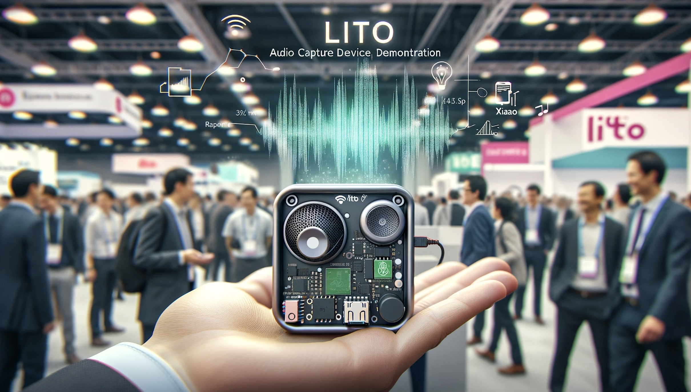
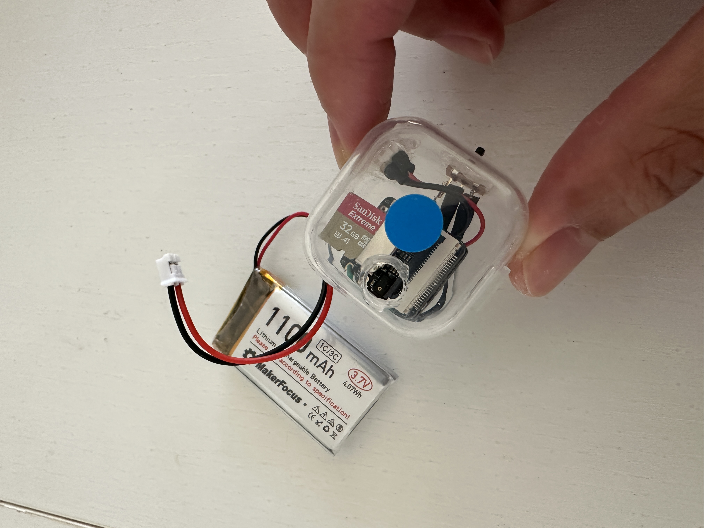

# Intro to Lito 
Lito: A lightweight, powerful, and easy-to-use audio recording and transcription device for capturing key interactions effortlessly.

## Overview of Lito
Lito is a versatile audio recording and transcription analysis device, powered by popular XIAO Sense board and Raspberry Pi computer. This device excels in any environment where capturing and analyzing spoken interactions is crucial. It records conversations with precision, allowing for transcription and the extraction of key information. The insights derived from these recordings can be easily shared with anyone the user chooses, enhancing the utility and reach of the recorded content. For instance, at trade fairs, sales teams or customer support personnel can efficiently record and collect information from visitors and customers for later analysis, ensuring no key points are missed.

Lito是一款多功能的音频录音和转录分析设备，由广受欢迎的XIAO Sense板和Raspberry Pi计算机驱动。它可以精确记录对话，允许进行转录和文本分析。从这些记录中得到的洞察可以轻松地与用户选择的任何人共享，增强了记录内容的实用价值！例如，在贸易展会上，销售团队或客户支持人员可以有效地记录和收集来自访客和客户的信息，以便后期分析，确保不遗漏任何关键点。

